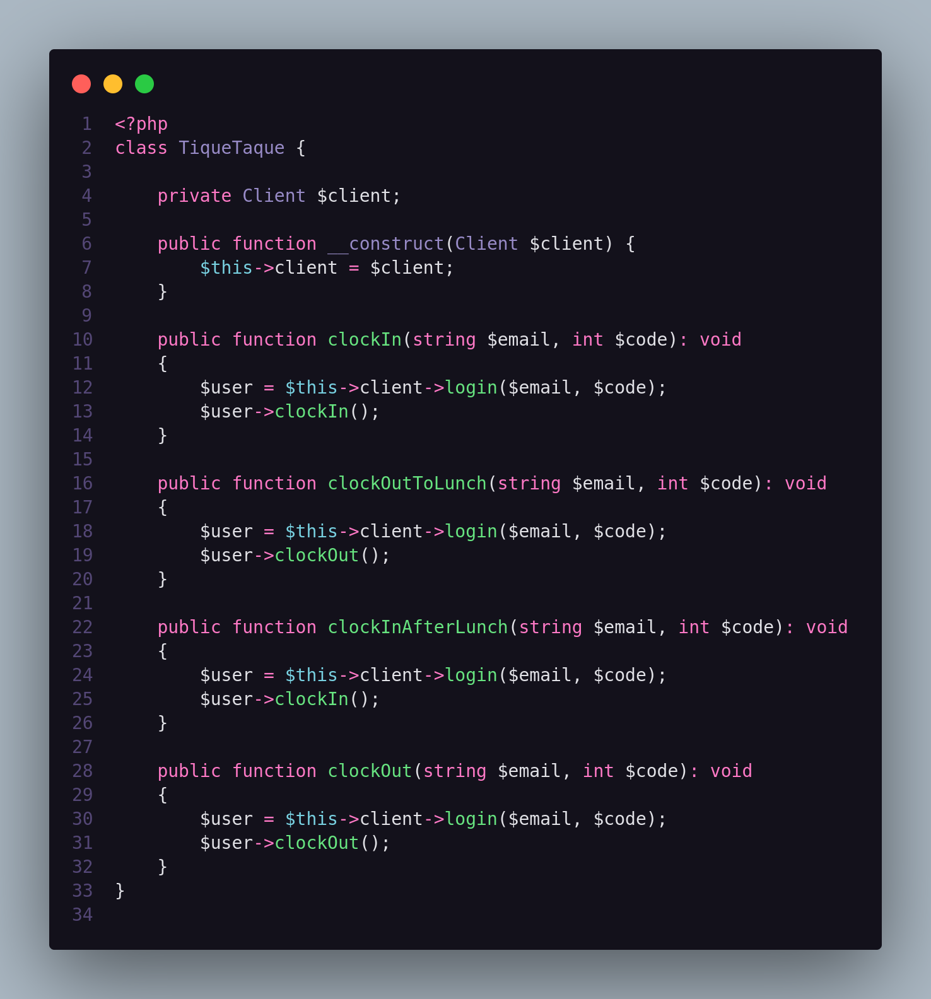
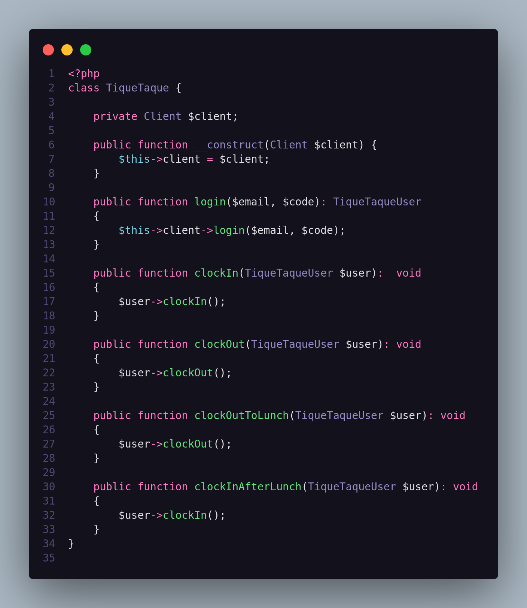

# Don't Repeat Yourself (DRY)
A ideia aqui é simples:

:exclamation: Evitar que regras de negócio sejam repetidas desnecessariamente :exclamation:

## Hands On
### Logo abaixo podemos ver um pequeno código que repete uma **simples** regra de negócio:

### Aqui, vemos como podemos evitar esse tipo de repetição:

---

> ### Obs.: Embora haja um forte acoplamento nessa classe, a ideia aqui foi apenas demonstrar como resolver um simples problema envolvendo DRY!!