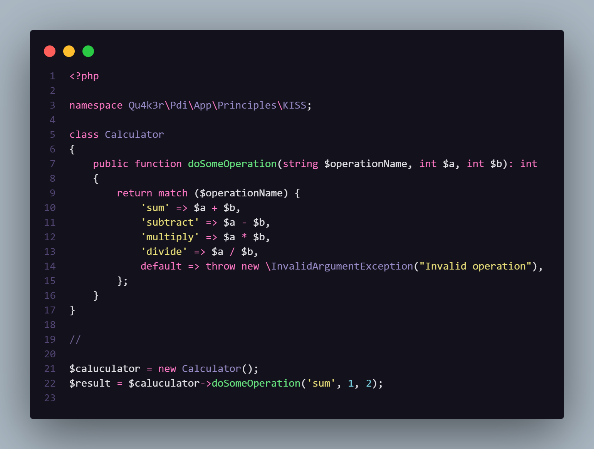
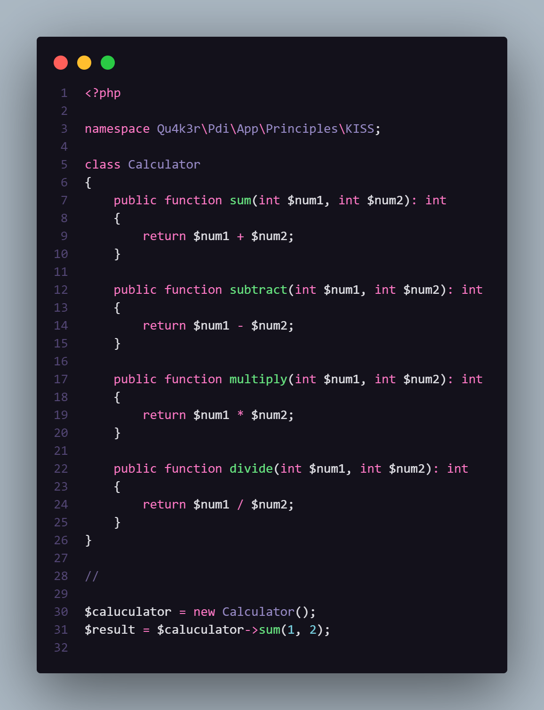

# KISS (Keep it simple and stupid)
Esse princípio, basicamente, diz que devemos manter nossos códigos o mais simples possível. Como isso pode ser feito?

Primeiramente precisamos entender o que é um código simples.

Resumidamente: todo código simples deve apresentar essas três características:

- Fácil e rápida leitura;
- Fácil e rápido entendimento;
- Fácil e rápida manutenção;

Devemos lembrar, também, que verbosidade não é, necessariamente, diretamente proporcional à complexidade.

Para manter nosso código simples, devemos evitar o uso abusivo de:

- acoplamento;
- polimorfismo;
- encapsulamento;
- herança múltipla;

Isso não significa que devemos abrir mão de qualquer tipo de abstração, apenas usá-las com parsimônia.

> Obs.: um código pode ser muito verboso, com considerável acoplamento e encapsulamento, porém sua manutenção é caracterizada como rápida e fácil quando o desenvolvedor sabe **o que** fazer, **onde** fazer e **como** fazer, mas isso não significa que o código seja simples, apenas que o desenvolvedor possui considerável experiência no contexto inserido.

--- 
# Hands On
Primeiramente, vamos ver um exemplo de um código que não segue o KISS:

Agora, aplicando o princípio ...

Muito melhor, não acha?
