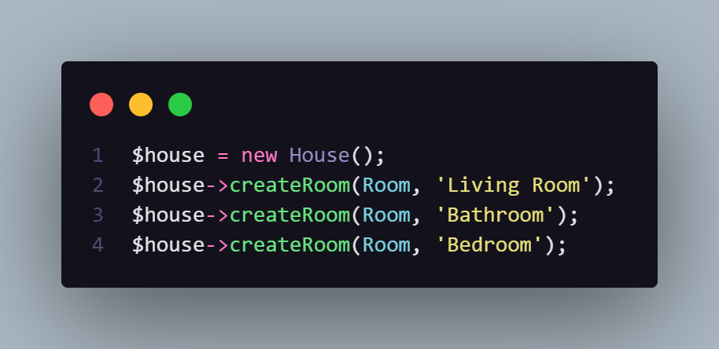

# The Dependency Inversion Principle

Resumidadmente, esse princípio diz que nossas classes e/ou métodos não devem depender de classes concretas, mas sim de abstrações.

Por exemplo, imagine que a classe *House* tenha um método responsável por criar um novo cômodo.

A solução mais óbvia seria criar um método para cada cômodo (sala de estar, cozinha, quarto etc ...)

Porém, agora sabemos que é uma boa prática nosso método depender de uma abstração e não de um objeto concreto. Logo, podemos implementá-lo da seguinte maneira:

