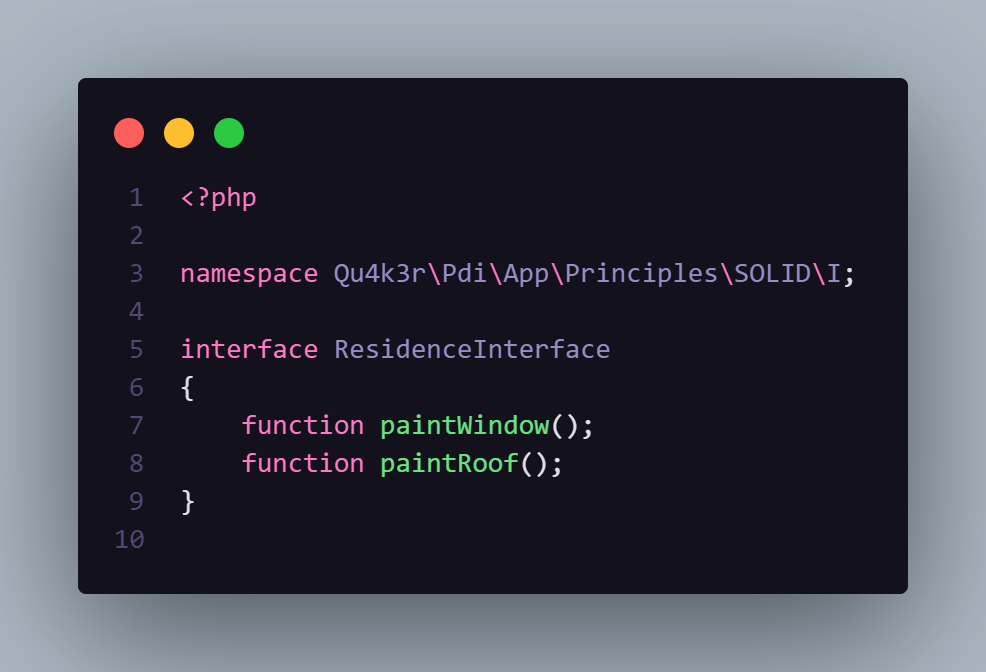
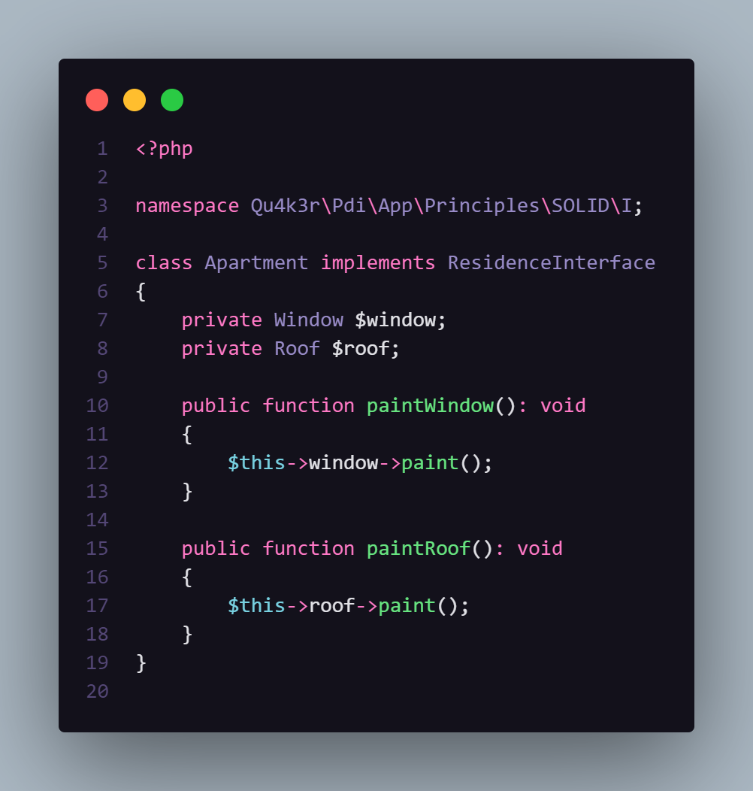
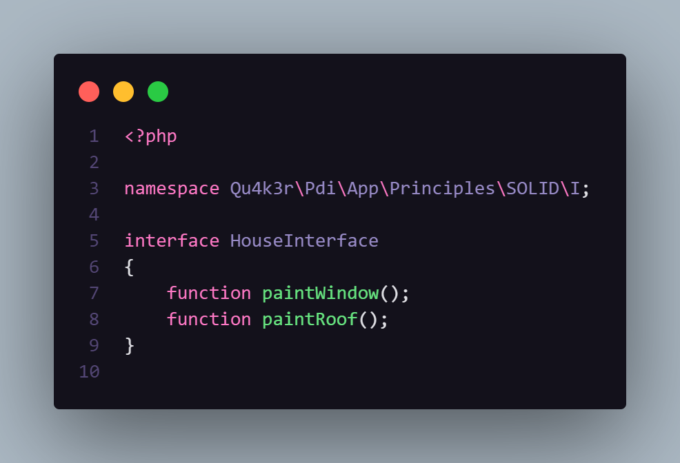
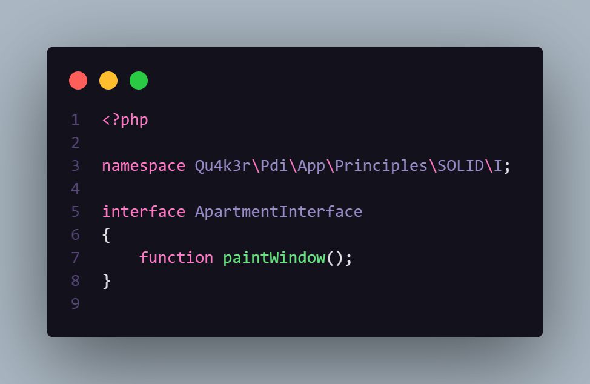
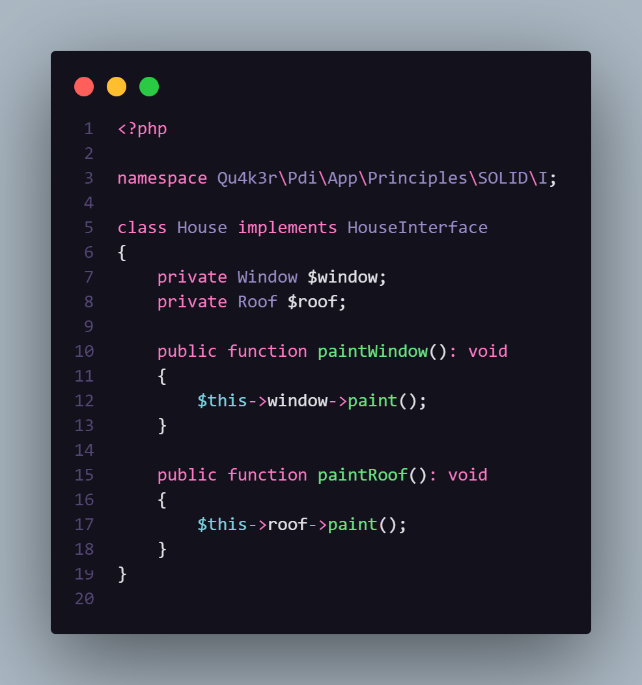
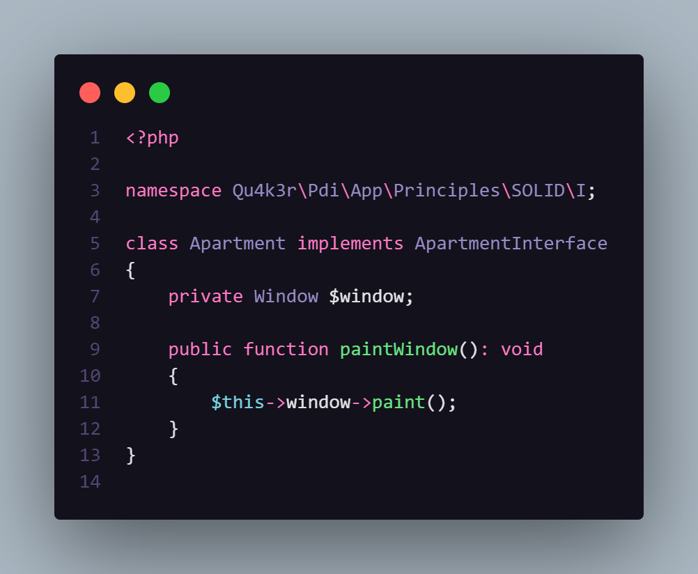

# The Interface Segregation Principle

Esse princípio diz que "clientes" (classes) que "assinam" um "contrato" (interface) não devem ser reféns de métodos e/ou atributos que não sejam necessários.

Traduzindo:
Essas interfaces devem ser bem segregadas para que todo o contrato seja cumprido.

## Hands On
Aqui, temos as classes *House* e *Apartment* que implementam a interface *ResidenceInterface*.

Como podemos ver, o atributo `roof` e o método `paintRoof` são complementamente inúteis na classe *Apartment*.

## Solução

Nesse caso, devemos isolar cada interface para que contrato seja cumprido da maneira correta

---

> ### Mero exemplo ilustrativo, sem complexidade

> ### Uma outra solução seria implementar uma classe abstrata para que *House* e *Apartment* herdassem o método `paintWindow` e, assim, evitar duplicação de código e/ou até mesmo alguma regra de negócio em códigos mais complexos
