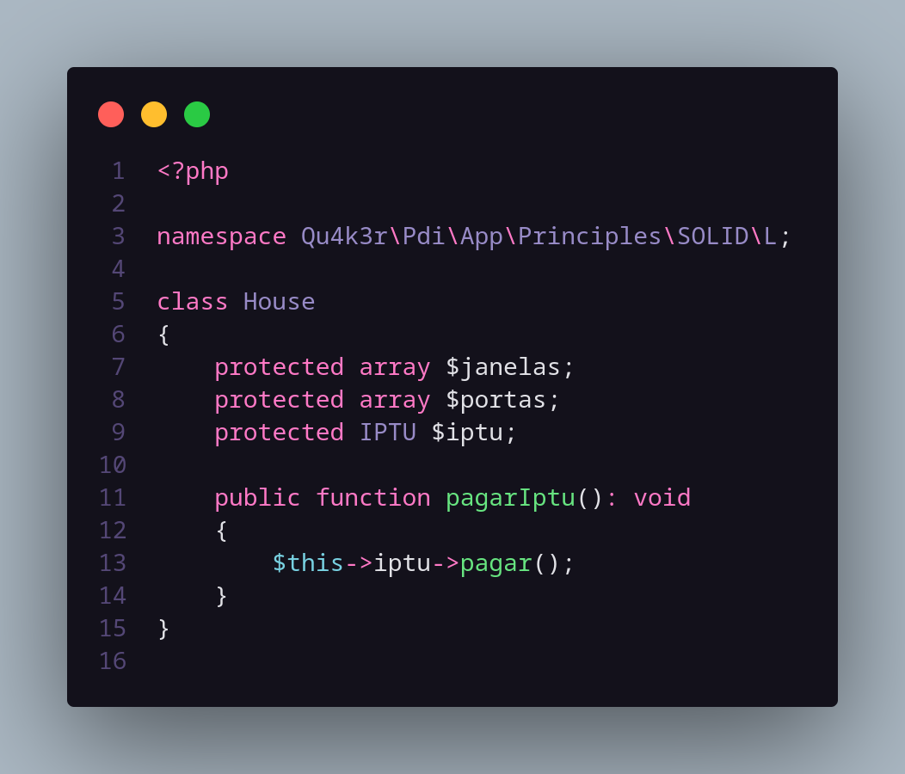
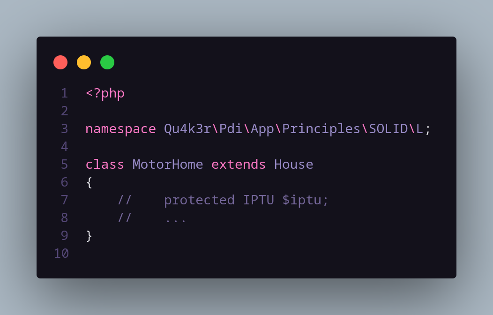
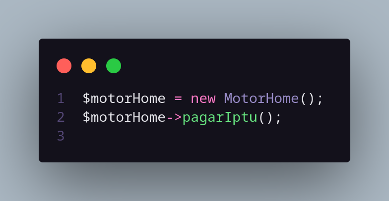
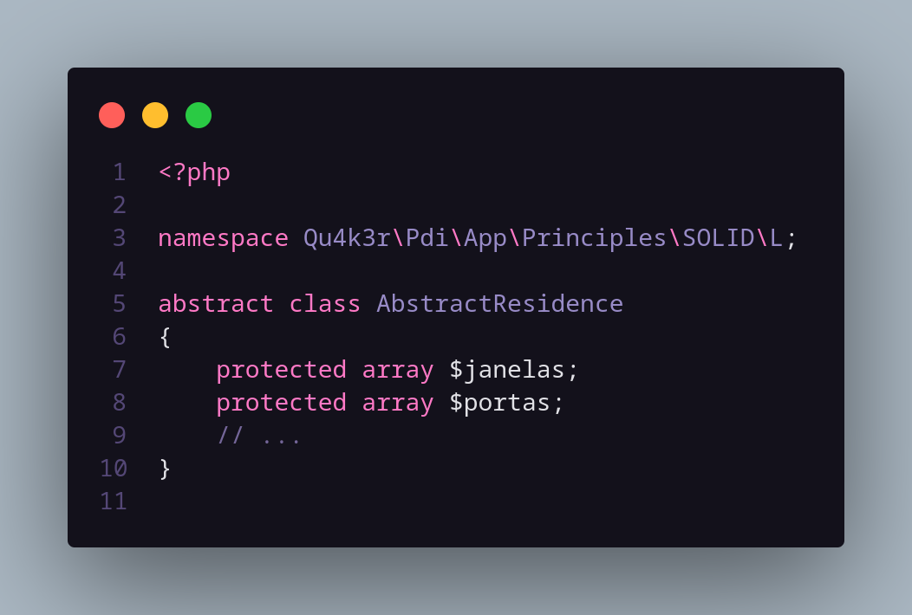
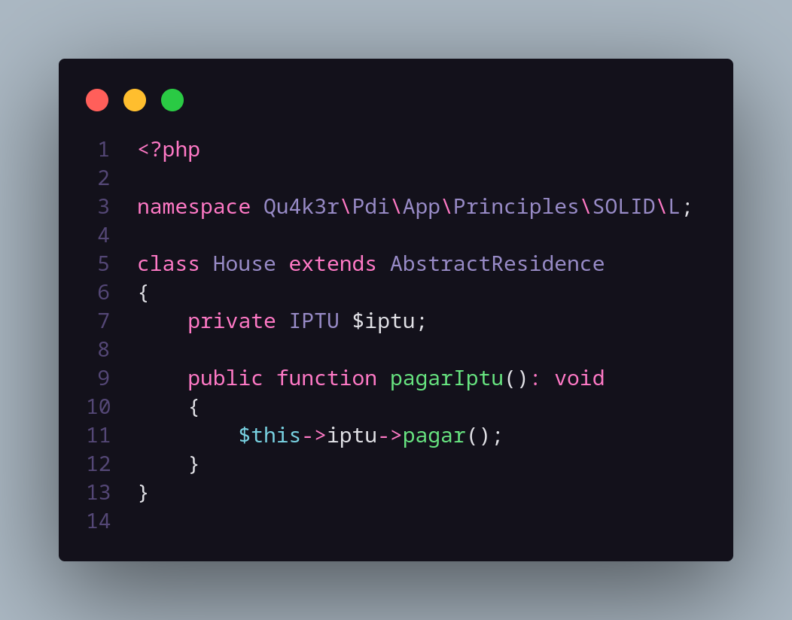
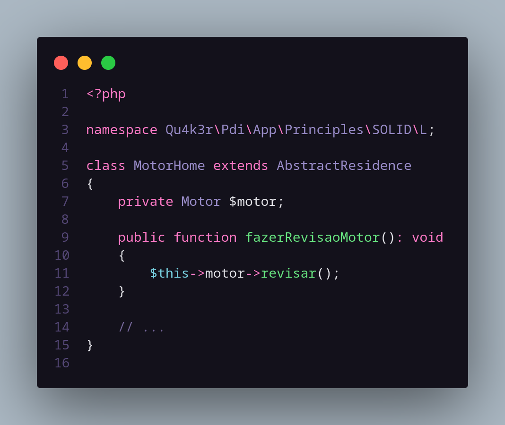

# The Liskov Substitution Principle

De modo bem resumido, esse princípio prega que todo subtipo ou subclasse deve ser capaz de entregar o mesmo valor que sua classe ou objeto pai.

Veremos a seguir um exemplo que quebra esse princípio e como resolvê-lo (de forma simples).

## Hands On
Aqui, vemos uma classe *House* e uma classe *MotorHome* que herda suas propriedades.

De certa forma, as duas servem como moradia, certo?

Porém, ainda que tenham propriedades em comum, também possuem caracteristícas próprias que a outra não possuem, mesmo sendo um subtipo de **moradia**.

Por exemplo, para se ter uma casa é preciso pagar IPTU.

Sabemos que motor-home é um subtipo de casa, então podemos simplesmente herdá-la:

Porém, isso não faz muito sentido. Não precisamos pagar IPTU de um motor-home.

## Solução

Deveríamos ter estabelecido um "contrato" que define as propriedades de uma moradia. Por exemplo:

Agora, vejamos como fica a responsabilidade de cada entidade com nosso contrato estabelecido:

Muito melhor, não acha? :)

---

> ### Obs.: Misturei português com inglês, sei que não foi uma boa prática (*Sorry about that ...*)
> ### Mero exemplo ilustrativo, sem complexidade
