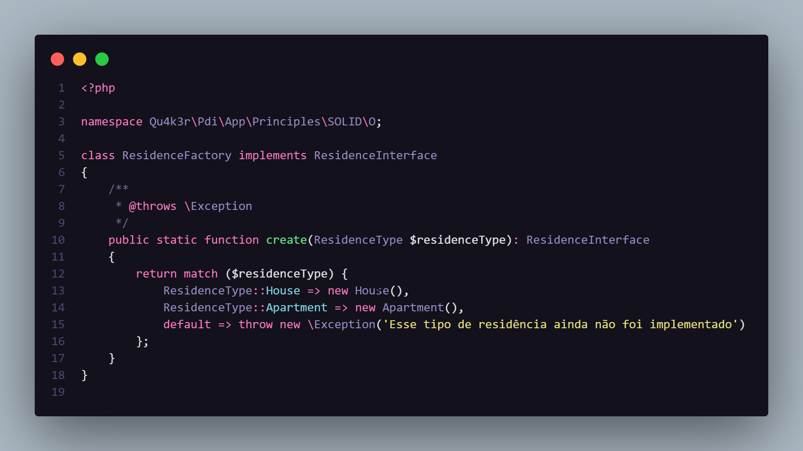
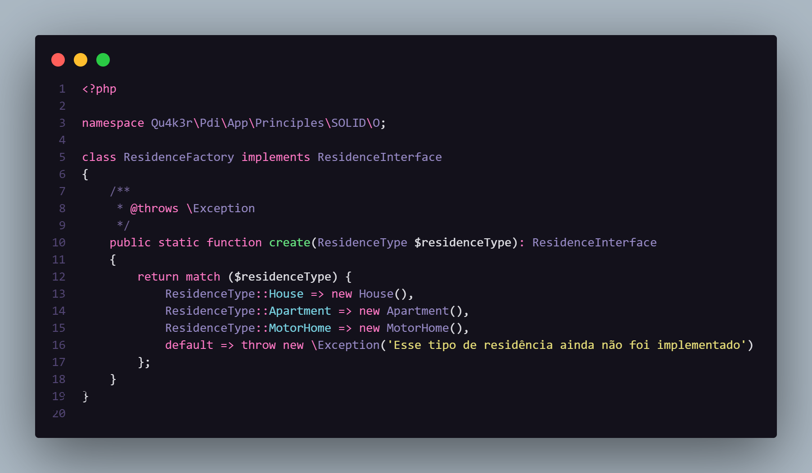

# The Open-Closed Principle

Uma classe ou método devem estar sempre **abertos** para receberem novas funcionalidades, porém **fechado** para modificações em seu comportamento original.

## Hands On
### Logo abaixo veremos um simples código que faz uso desse princípio:

Agora, se quisermos criar um novo tipo de residência ou moradia, basta acrescentarmos essa nova funcionalidade em nossa factory.

Voilà ... Eis aí o princípio aberto fechado implementado de maneira simples.

---

> ### Obs.: Mero exemplo ilustrativo, sem complexidade
