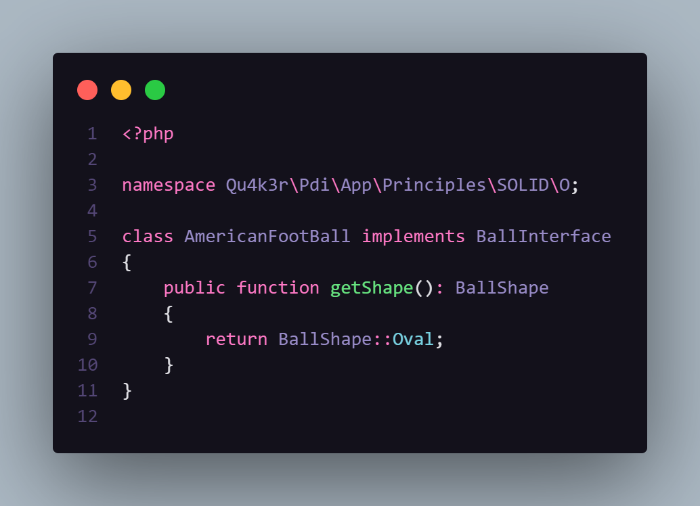
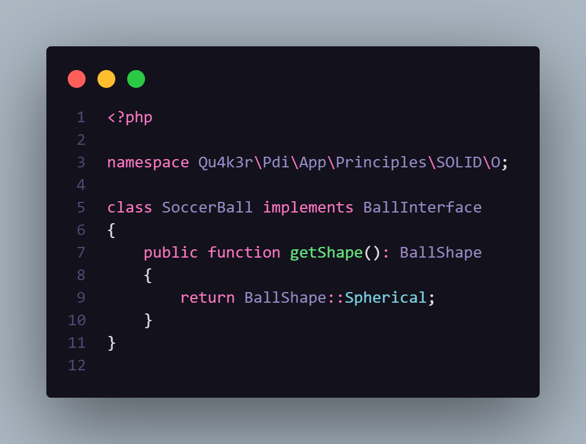

# The Open-Closed Principle

Uma classe ou método devem estar sempre **abertos** para receberem novas funcionalidades, porém **fechado** para modificações em seu **comportamento original**.

Você deve ser capaz de estender o comportamento de uma classe sem a necessidade de modificá-la.

> Curiosidade: O *design pattern* Factory viola esse princípio, (para mim, não faz muito sentido, pois não há modificação no comportamento original da factory, mas tudo bem. Eu posso aceitar isso e meu coração continua aberto).

## Hands On
### Aqui, vemos uma bola de futebol assinando o contrato *bola*:

### Agora, vamos criar outra bola de maneira que o contrato não seja quebrado, ou seja, sem que a funcionalidade de bola seja modificada ou perdida 

Voilà! Eis aí o princípio aberto fechado implementado de maneira simples.

---

> ### Obs.: Mero exemplo ilustrativo, sem complexidade
