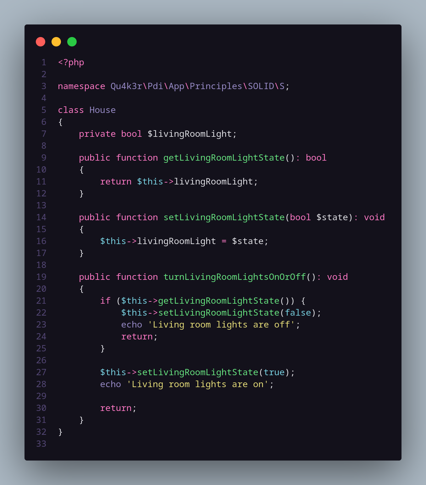
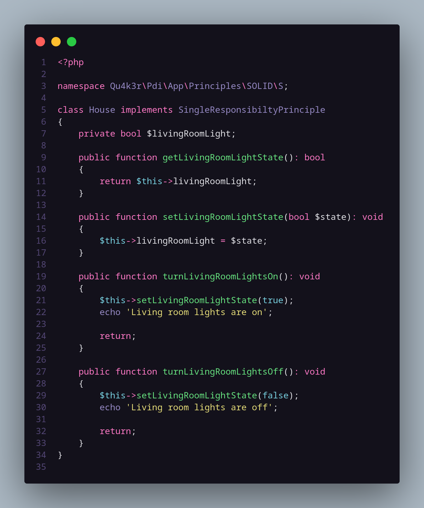

# The Single Responsibility Principle

Esse princípio, de forma bem resumida, diz que um  objeto (classe) ou método deve ter apenas um propósito ou funcionalidade.

De forma lógica, também podemos dizer que ele deve ter apenas um **motivo** para sofrer alteração.

A partir do momento que ele possui mais de um motivo para mudança, automaticamente, ele possui mais de uma responsabilidade, correto?
Não queremos isso!

## Hands On
### Logo abaixo podemos ver um simples código que não implementa esse princípio:

### Aqui, vemos a simples implementação desse princípio:

---

> ### Obs.: Mero exemplo ilustrativo, sem complexidade
